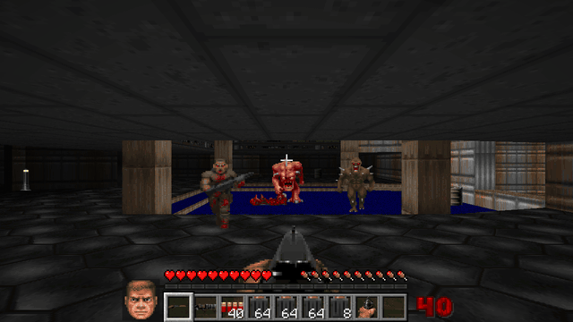

# Knee-Deep in the Mines

Doom and Minecraft collide. This project takes Doom's own game file, the WAD that holds every map, monster, texture, sound and song, and merges it straight into Minecraft. Nothing is remade by hand. Doom's levels are read from the original data and rebuilt as a world you walk into as Steve, with your hearts, hotbar, inventory and Minecraft's physics. Doom's monsters hunt you inside it, and Doom's guns end up in your hotbar.

It was inspired by the recent wave of people putting one game inside another, such as Spider-Man inside Arkham Knight and RDR2 inside GTA V. This is the same idea for Doom and Minecraft.

## Playing

You need Minecraft 26.3 with Fabric Loader and Fabric API installed. Put `mod/build/libs/doomcraft-1.0.0.jar` in the `mods` folder and start the `fabric-loader-26.3` profile.

In any world, `/doom` takes you to E1M1, `/doom e1m4` takes you to a chosen map, `/doom leave` takes you home and `/doom reset e1m1` puts a map back to how it started. `/doom spawn imp` puts a monster in front of you. No cheats are needed, so it works in survival. There is also a Doom Arcade block. Sneaking and right-clicking it drops you into E1M1, and right-clicking it normally sits you down to play the original game on its screen.

Inside Doom, right-click a wall to use it, which opens doors and presses switches. Left-click fires a Doom weapon. You arrive with a pistol and 50 bullets, and weapons, ammo, health, armor, powerups and keycards are picked up by walking over them. The exit switch shows Doom's tally of kills, items, secrets and time, then loads the next map. Dying restarts the map you were on.

The shareware `DOOM1.WAD` with episode 1 is included. To play other episodes, put your own `doom.wad` or `doom2.wad` in `config/doomcraft/wads/`.

## How the two worlds are merged

Doom's levels come straight out of the WAD. Its BSP tree gives the exact floor shape of every room, and Doom's walls, floors and ceilings are drawn in Minecraft with Doom's textures, texture alignment, sector lighting, flickering lights, animated nukage and scrolling walls. Wherever Doom has open sky, you see the Minecraft sky.

Underneath, every map is filled with invisible blocks so Minecraft's movement, jumping and pathfinding work unchanged. One block is 32 Doom units, which makes Steve exactly as tall as the Doom marine. Floors are stepped in eighths of a block. A column that touches a door takes that door's height, so a closed door seals its passage even though Doom's doors are thinner than a block.

Doom's level logic runs at Doom's own speeds. Doors, keycard doors, lifts, moving floors and ceilings, stairs, light changes, teleporters, exits, secret exits, damaging floors and secret areas all work. Monsters follow Doom's rules for waking up, chasing, shooting, flinching and fighting each other, and they open doors. Bullets use Doom's damage and spread. One Minecraft health point is five Doom points, so a full-health Steve takes Doom's hits like a marine on 100%.

Where the two games' rules clash, Doom wins inside its own world. Hunger pauses and health does not refill on its own, so you heal from stimpacks and medikits, which also top up the food bar. There is no fall damage. Doom's pickup messages, the marine's face, the ammo count and keycards sit next to Minecraft's HUD, and every sound and song comes from the WAD.

## Building

Clone with `git clone --recursive`, because the arcade's Doom engine is built from the doomgeneric submodule. A prebuilt macOS engine is already included, so `make -C engine` is only needed after changing it. Build with JDK 25 by running `./gradlew build` in `mod/`, and the jar lands in `mod/build/libs/`.

## Layout

`engine/` builds the doomgeneric engine used by the arcade as a universal macOS binary, from the upstream source in `doomgeneric/`. `mod/` holds the Minecraft side, with shared code in `src/main` and rendering, sound and HUD code in `src/client`. `tools/make_item_assets.py` pulls the weapon and ammo icons out of the WAD.

## Tests

`./gradlew runGameTest` runs headless server tests. They build E1M1, check its monsters, pickups and start position, and then open and close a door. They also run E1M2's lift, keycard door and donut, E1M3's lights going out, and a barrel explosion. `./gradlew runClientGameTest` opens a real game window and plays through E1M1 with real inputs. It enters through the arcade, checks hunger, opens the first door with a right-click and walks through it, fires the shotgun, watches an imp throw a fireball, checks falling, takes a pickup, presses the exit switch into E1M2, dies and respawns there, and leaves. Both pass on 5 October 2026. The clip at the top of this page was recorded by `DoomTrailerTest`, which saves one frame per tick when `DOOMCRAFT_RECORD` names a folder and does nothing otherwise.

## Limitations

The arcade's engine is built for macOS only. The Doom world itself needs no native code and should run anywhere. The shareware WAD has no sprites for the cacodemon, lost soul, plasma rifle or BFG, so those appear only with a full IWAD. Crushing ceilings, Doom II's specials and monster-only teleporters are not implemented. The invisible blocks are one block across, so a wall can sit up to half a block away from where it is drawn, and very thin features may not block. Monsters use Minecraft's pathfinding, which can get stuck where Doom's would not. Only E1M1 to E1M3 have been exercised by tests. The other episode 1 maps load and draw but have not been played through.
